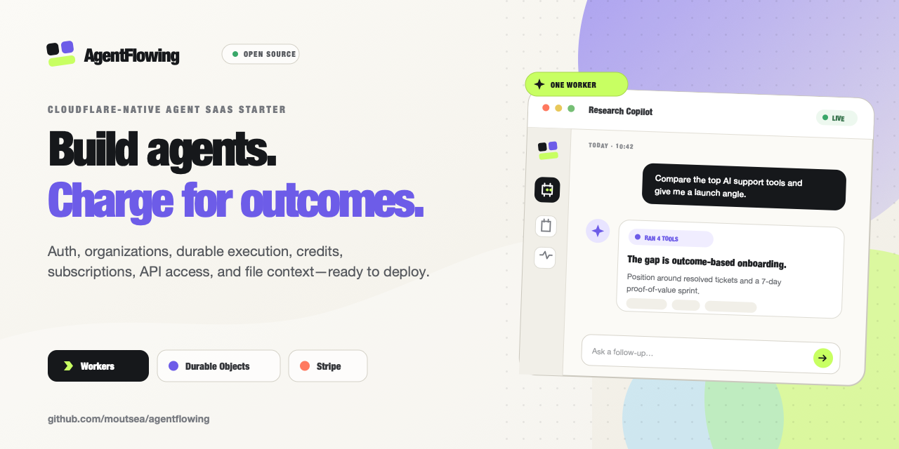

# AgentFlowing

English | [简体中文](README.zh-CN.md)

[Website](https://agentflowing.app) · [GitHub](https://github.com/moutsea/agentflowing)



An open-source, Cloudflare-native starter for launching subscription and credit-based AI Agent SaaS products.

AgentFlowing combines a React product UI, Better Auth, organization tenancy, durable streaming conversations, usage credits, Stripe billing, API access, and file context in one deployable Cloudflare Worker. Keep the SaaS foundation, replace the sample Agent and product copy, then build your own product.

> **Project status:** early-stage starter (`0.1.x`). The core accounting and tenant boundaries are tested, but every deployment still requires product-specific security review, pricing calibration, provider setup, and operational monitoring.

## Why AgentFlowing

Most Agent demos stop at a chat box. A commercial product also needs identity, tenant isolation, billing, replay protection, file storage, API access, and failure recovery. AgentFlowing provides those foundations without requiring a permanent application server or Kubernetes cluster.

## Features

- React 19 product UI with English and Simplified Chinese localization
- Better Auth email/password, GitHub/Google OAuth, Magic Link, and password reset
- Organization workspaces with owner/admin/member authorization
- Agent catalog with create, edit, publish, archive, visibility, and model policies
- Streaming conversations using Cloudflare Agents SDK and Durable Objects
- Workers AI model execution with server-controlled output and tool-step limits
- Immutable D1 credit ledger with overdraft protection and idempotent charges/refunds
- Stripe Checkout, customer portal, subscription webhooks, and recurring credit grants
- R2 file uploads with tenant checks, MIME validation, and size limits
- Scoped, hashed API keys for server-to-server Agent execution
- Cloudflare Rate Limiting, request IDs, structured logs, CSP, and security headers
- Worker-runtime integration tests, generated Cloudflare types, and GitHub Actions CI

### Feature availability

| Capability                | Default local setup     | Additional setup                                 |
| ------------------------- | ----------------------- | ------------------------------------------------ |
| Email/password            | Enabled                 | Set `BETTER_AUTH_SECRET`                         |
| GitHub/Google OAuth       | Hidden until configured | Provider credentials and callback URLs           |
| Magic Link/password reset | Hidden until configured | Cloudflare Email Sending domain and `EMAIL_FROM` |
| Stripe subscriptions      | UI remains in free mode | Stripe keys, prices, and webhook                 |
| Workers AI                | Remote binding enabled  | Cloudflare login/account access                  |
| D1/R2/Durable Objects     | Local emulation         | Provision production resources before deploy     |

Email verification is not required by default. Turnstile and a Cloudflare Workflow binding are not included yet; both are extension points for products that need stronger signup protection or long-running jobs.

## Stack

| Layer                  | Technology                                          |
| ---------------------- | --------------------------------------------------- |
| Product UI             | React 19, Vite, Tailwind CSS, `react-i18next`       |
| HTTP runtime           | Cloudflare Workers, Hono                            |
| Stateful Agent runtime | Cloudflare Agents SDK, Durable Objects, Workers AI  |
| Identity               | Better Auth, OAuth, Magic Link, organization plugin |
| Data                   | D1, Drizzle ORM, SQL migrations                     |
| Files                  | R2                                                  |
| Billing                | Stripe subscriptions and an immutable credit ledger |
| Quality                | Vitest Workers pool, TypeScript, Oxlint, Oxfmt      |

## Architecture

```text
React SPA
  ├─ Hono API on Cloudflare Workers
  │  ├─ Better Auth + organization workspaces
  │  ├─ D1 business data + immutable credit ledger
  │  ├─ Stripe checkout + verified webhooks
  │  ├─ R2 files + scoped API keys
  │  └─ rate limits + observability
  └─ Cloudflare Agents SDK
     └─ one Durable Object per conversation
        ├─ ordered messages + streaming
        └─ tools + recovery hooks
```

See [docs/architecture.md](docs/architecture.md) for accounting, tenancy, recovery, and module-boundary decisions.

## Quick Start

### Requirements

- Node.js 22+
- pnpm 10+
- A Cloudflare account for the remote Workers AI binding

### Run locally

```bash
git clone https://github.com/moutsea/agentflowing.git
cd agentflowing
pnpm install
cp .dev.vars.example .dev.vars
pnpm exec wrangler login
pnpm cf-typegen
pnpm db:migrate:local
pnpm dev
```

Set `BETTER_AUTH_SECRET` in `.dev.vars` to a random value of at least 32 characters. For example:

```bash
openssl rand -base64 32
```

The default URL is [http://localhost:5173](http://localhost:5173). If Vite selects another port, update `APP_URL` in `wrangler.jsonc` and any OAuth callback URLs so the origins match exactly.

Run the full verification suite:

```bash
pnpm check
pnpm exec wrangler deploy --dry-run
```

## Vibe Coding Channels

Use the channel that matches your preferred AI coding ecosystem:

| Models                        | Channel                          |
| ----------------------------- | -------------------------------- |
| Claude, Codex, Gemini         | [CodeByAI](https://codebyai.net) |
| Kimi, GLM, Qwen, and DeepSeek | [KimiSeek](https://kimiseek.app) |

## Configuration

AgentFlowing uses `wrangler.jsonc` for non-sensitive defaults and Cloudflare bindings. Local secrets belong in `.dev.vars`; production secrets should be added with `wrangler secret put`. A conventional `.env.example` is also provided for tooling and discoverability, but `.dev.vars.example` is the canonical local Worker template.

### Application variables

| Variable                  | Required | Default                 | Purpose                                                         |
| ------------------------- | -------- | ----------------------- | --------------------------------------------------------------- |
| `APP_NAME`                | Yes      | `AgentFlowing`          | Product name used by the Worker and auth emails                 |
| `APP_URL`                 | Yes      | `http://localhost:5173` | Canonical origin for Better Auth, Stripe, and redirects         |
| `DEFAULT_AI_MODEL`        | Yes      | GLM 4.7 Flash           | Starter Agent model; must exist in `src/shared/ai-models.ts`    |
| `FREE_CREDITS`            | Yes      | `100`                   | Credits granted to a new workspace                              |
| `MESSAGE_CREDIT_COST`     | Yes      | `1`                     | Initial sample Agent cost, bounded by the model minimum         |
| `AGENT_RUN_STALE_SECONDS` | Yes      | `1800`                  | Age after which the cron reaper cancels and refunds a stuck run |

### Secrets and optional providers

| Variable                                        | Required | Purpose                                                        |
| ----------------------------------------------- | -------- | -------------------------------------------------------------- |
| `BETTER_AUTH_SECRET`                            | Yes      | Better Auth signing/encryption secret; minimum 32 characters   |
| `GITHUB_CLIENT_ID` / `GITHUB_CLIENT_SECRET`     | No       | Enables GitHub OAuth when both are set                         |
| `GOOGLE_CLIENT_ID` / `GOOGLE_CLIENT_SECRET`     | No       | Enables Google OAuth when both are set                         |
| `EMAIL_FROM`                                    | No       | Enables Magic Link and password reset with the `EMAIL` binding |
| `EMAIL_FROM_NAME`                               | No       | Authentication email sender name                               |
| `MAGIC_LINK_EXPIRES_SECONDS`                    | No       | Magic Link lifetime; defaults to 900 seconds                   |
| `STRIPE_SECRET_KEY`                             | No       | Enables Stripe checkout and customer portal                    |
| `STRIPE_WEBHOOK_SECRET`                         | No       | Verifies Stripe webhook signatures                             |
| `STRIPE_PRO_PRICE_ID` / `STRIPE_SCALE_PRICE_ID` | No       | Server-authoritative recurring prices                          |

Do not prefix secrets with `VITE_`; Vite-prefixed variables are exposed to browser code.

### Cloudflare bindings

`wrangler.jsonc` defines these bindings:

- `DB`: D1 database
- `FILES`: R2 bucket
- `MonetizedAgent`: Durable Object namespace
- `AI`: Workers AI
- `EMAIL`: Email Sending
- `AUTH_RATE_LIMITER`, `API_RATE_LIMITER`, `AI_RATE_LIMITER`, `WEBHOOK_RATE_LIMITER`

## Authentication Providers

OAuth buttons are returned by `GET /api/auth/capabilities` only when the matching credential pair exists. Provider secrets never reach the browser.

Configure these callbacks in GitHub and Google:

```text
https://your-domain.example/api/auth/callback/github
https://your-domain.example/api/auth/callback/google
```

Authentication email uses Cloudflare Email Sending rather than a third-party API key:

```bash
pnpm exec wrangler email sending enable mail.your-domain.example
pnpm exec wrangler email sending dns get mail.your-domain.example
```

After publishing the required DNS records, set `EMAIL_FROM` to an address on the enabled domain.

## Production Deployment

1. Create the Cloudflare resources:

   ```bash
   pnpm exec wrangler d1 create agentflowing-db
   pnpm exec wrangler r2 bucket create agentflowing-files
   ```

2. Replace the placeholder D1 database ID and rate-limit namespace IDs in `wrangler.jsonc`.
3. Set the production `APP_URL` and review the model/credit defaults.
4. Add secrets without committing them:

   ```bash
   pnpm exec wrangler secret put BETTER_AUTH_SECRET
   pnpm exec wrangler secret put STRIPE_SECRET_KEY
   pnpm exec wrangler secret put STRIPE_WEBHOOK_SECRET
   pnpm exec wrangler secret put STRIPE_PRO_PRICE_ID
   pnpm exec wrangler secret put STRIPE_SCALE_PRICE_ID
   ```

5. Apply migrations and deploy:

   ```bash
   pnpm db:migrate:remote
   pnpm deploy
   ```

6. Configure the Stripe webhook at:

   ```text
   https://your-domain.example/api/billing/webhooks/stripe
   ```

   Subscribe to `checkout.session.completed`, `checkout.session.async_payment_succeeded`, `customer.subscription.created`, `customer.subscription.updated`, `customer.subscription.deleted`, `invoice.paid`, and `invoice.payment_failed`.

### Before accepting real payments

- Calibrate every model's minimum credit cost against current inference and payment fees.
- Replace the sample plans, prices, Agent prompt, and product copy.
- Configure OAuth/email domains and decide whether email verification is mandatory.
- Add bot protection if anonymous signup abuse is a concern.
- Review data retention, privacy, tax, refund, and terms-of-service requirements.
- Tune rate limits, logging, trace sampling, and stale-run timeout for expected traffic.
- Exercise Stripe sandbox checkout, renewals, failures, retries, and refunds.
- Run `pnpm check` and `wrangler deploy --dry-run` from a clean checkout.

## Billing Semantics

Billing is per model run, not per user message. Tool continuations may create additional model runs and consume additional credits. The Worker captures the Agent's configured price before inference; failed, canceled, interrupted, and stale attempts refund the immutable captured amount exactly once.

Browser message IDs reject replays. External API idempotency keys replay a stored completed result without another model call or charge. D1 constraints, rather than the rate limiter, protect credit accounting.

## External API

Create a scoped API key in **Settings → API keys**. Keys are displayed once and stored only as SHA-256 hashes.

```bash
curl https://your-domain.example/api/v1/agents \
  -H "Authorization: Bearer af_live_your_key"
```

See [docs/api.md](docs/api.md) for scopes, execution, attachments, idempotency, and error envelopes.

## Project Layout

```text
src/
  client/                     React product and management UI
  server/
    agents/                   Durable conversation runtime
    auth/                     Better Auth and transactional email
    db/                       Drizzle schema
    middleware/               Identity, rate limits, observability
    modules/                  Domain services and Hono routes
  shared/                     Product and model catalogs
migrations/                   D1 migrations and accounting invariants
public/                       Static security headers
test/                         Workers-runtime integration tests
docs/                         Architecture and external API notes
```

## Common Commands

| Command                  | Purpose                                                    |
| ------------------------ | ---------------------------------------------------------- |
| `pnpm dev`               | Start the local full-stack Worker                          |
| `pnpm cf-typegen`        | Regenerate `env.d.ts` from Wrangler config                 |
| `pnpm db:migrate:local`  | Apply D1 migrations locally                                |
| `pnpm db:migrate:remote` | Apply D1 migrations remotely                               |
| `pnpm format`            | Format the repository                                      |
| `pnpm check`             | Format check, lint, typecheck, tests, and production build |
| `pnpm deploy`            | Build and deploy with Wrangler                             |

## Roadmap

- Optional email verification and resend flow
- Turnstile integration for public signup and password recovery
- Cloudflare Workflows adapter for long-running, resumable jobs
- Team invitation and seat-management UI
- Usage analytics and operator administration
- Automated deployment and release workflow

Roadmap items are not commitments. Contributions should start with an issue so scope and architecture can be agreed before implementation.

## Contributing and Security

Read [CONTRIBUTING.md](CONTRIBUTING.md) before opening a pull request. Use GitHub Issues for reproducible bugs and focused feature proposals.

Do not report vulnerabilities in public issues. Follow [SECURITY.md](SECURITY.md) for private disclosure instructions.

## License

[MIT](LICENSE) © 2026 AgentFlowing contributors.

AgentFlowing is a clean-room implementation inspired by common SaaS architecture patterns. It contains no ShipAny source code or proprietary assets.
